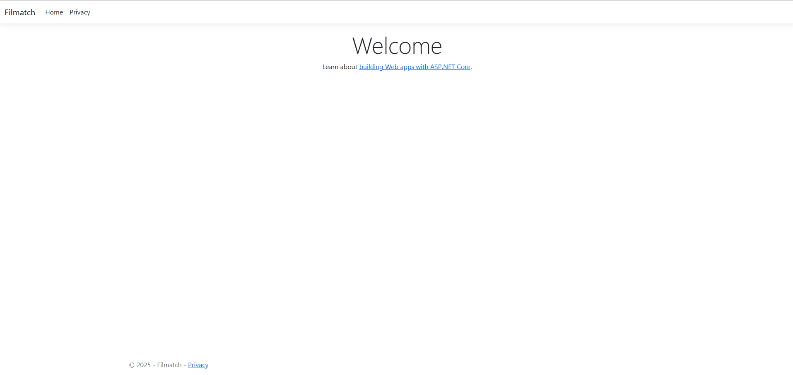

# 🎬 FilmMatcher

FilmMatcher — это приложение, которое помогает выбрать фильм для совместного просмотра с друзьями или второй половинкой с помощью свайпов влево и вправо, как в Tinder.

- 👉 Свайп вправо — фильм нравится  
- 👈 Свайп влево — фильм не нравится  
- 💘 Когда у двух (или больше) людей совпадают лайки — появляется **match-фильм**, который всем подходит

---

## ✨ Основные возможности

- 📱 Интерфейс в стиле Tinder для выбора фильмов
- 👥 Режим совместного выбора (пара / друзья / компания)
- 🎯 Поиск фильмов по жанрам, году, рейтингу и т.п.

---

## 🧠 Как это работает

1. Пользователь(и) выбирают набор фильмов для подбора (например, по жанрам или популярным).
2. Каждый участник по очереди/параллельно свайпает карточки фильмов:
   - 👉 Вправо — «хочу посмотреть»
   - 👈 Влево — «не интересно»
3. Приложение ищет пересечения лайков между участниками.
4. Если есть совпадения, отображается список **match-фильмов**.
5. Участники выбирают один из совпавших фильмов и… 🍿

---

## 🖼️ Скриншоты / демо



---

## 🚀 Быстрый старт  
Для работы потребуется mssql localdb

```bash
git clone https://github.com/<your-username>/filmmatcher.git
cd filmmatcher

dotnet ef database update --project Filmatch

dotnet run --project .\Filmatch\